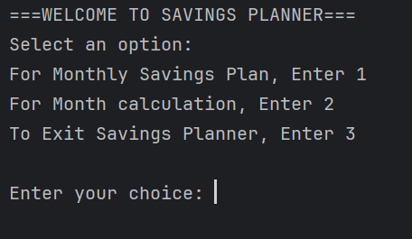
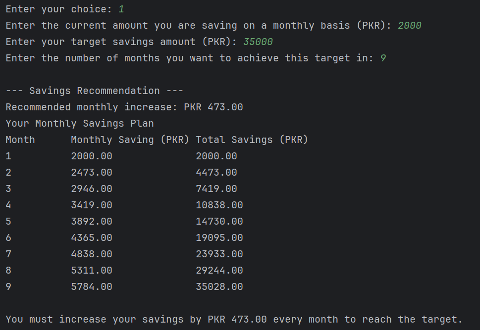
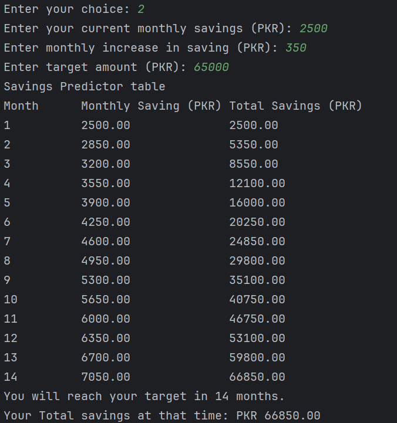

# Smart Savings Planner

A Java console application that applies **Discrete Mathematical Structures** to solve a real-world financial planning problem. The project models monthly savings using **Arithmetic Progressions (AP)** and **Finite Arithmetic Series** to help users plan and predict their savings.

> Developed as a course project for **CSC1201 – Discrete Mathematical Structures** at **SZABIST**.

---

## Overview

Smart Savings Planner assists users in planning their savings by calculating:

- The monthly increase required to reach a financial goal.
- The number of months required to achieve a target savings amount.
- A complete month-by-month savings schedule.

The application demonstrates how concepts from **Discrete Mathematics** can be applied to practical financial planning.

---

## Mathematical Concepts Used

This project is based on the following discrete mathematics topics:

- Discrete Sequences
- Arithmetic Progression (AP)
- Finite Arithmetic Series
- Mathematical Formula Derivation
- Iterative Algorithms
- Discrete Summation

### Arithmetic Series Formula

```
Sₙ = (n/2)[2a + (n − 1)d]
```

Where:

- **a** = Initial monthly savings
- **d** = Monthly increase
- **n** = Number of months
- **Sₙ** = Total savings after *n* months

The application also derives the formula to calculate the required monthly increase (**d**) when the savings target and duration are known.

---

## Features

### Monthly Savings Planner

Given:

- Current monthly savings
- Target savings
- Number of months

The application calculates:

- Required monthly increase
- Month-by-month savings table
- Total accumulated savings

### Month Prediction

Given:

- Current monthly savings
- Monthly increase
- Target amount

The application calculates:

- Number of months required
- Running savings total
- Final accumulated savings

### Input Validation

The program validates all user inputs by ensuring:

- Positive numeric values
- Positive integer months
- Valid menu selections
- Handling invalid input without crashing

---

## Sample Menu

```text
===WELCOME TO SAVINGS PLANNER===

1. Monthly Savings Plan
2. Month Calculation
3. Exit
```

---

## Technologies Used

- Java
- Object-Oriented Programming (OOP)
- Scanner Class
- Console-based Interface

---

## Project Structure

```text
Savings-Planner/
│
├── README.md
├── SavingPlanner.java
├── Smart Savings Planner - Report.pdf
└── screenshots/
    ├── menu.png
    ├── monthly-savings-plan.png
    └── month-predictor.png
```

---

## Application Screenshots

Below are sample outputs demonstrating the application's primary features.

### Main Menu



### Monthly Savings Planner



### Month Predictor



---

## Learning Outcomes

This project demonstrates the practical implementation of:

- Arithmetic Progressions
- Finite Arithmetic Series
- Algorithm Design
- Mathematical Modeling
- Java Programming
- Input Validation
- Looping Structures
- Problem Solving using Discrete Mathematics

---

## Future Improvements

Potential enhancements include:

- Java Swing or JavaFX graphical user interface
- Savings visualization using charts
- Interest rate calculations
- Savings history tracking
- Export plans as PDF
- Currency selection
- File-based data storage

---

## Report

The repository also includes the complete project report containing:

- Introduction
- Mathematical Background
- Formula Derivation
- Algorithm Description
- Sample Outputs
- Conclusion

**Project Report:** `Smart Savings Planner - Report.pdf`

---

## Authors

**Naushaba Asif**  
3rd Semester, Computer Science Student  
SZABIST Karachi

**Rohban Tariq**  
3rd Semester, Computer Science Student  
SZABIST Karachi

---

## License

This project was developed for educational purposes as part of the **CSC1201 – Discrete Mathematical Structures** course.
